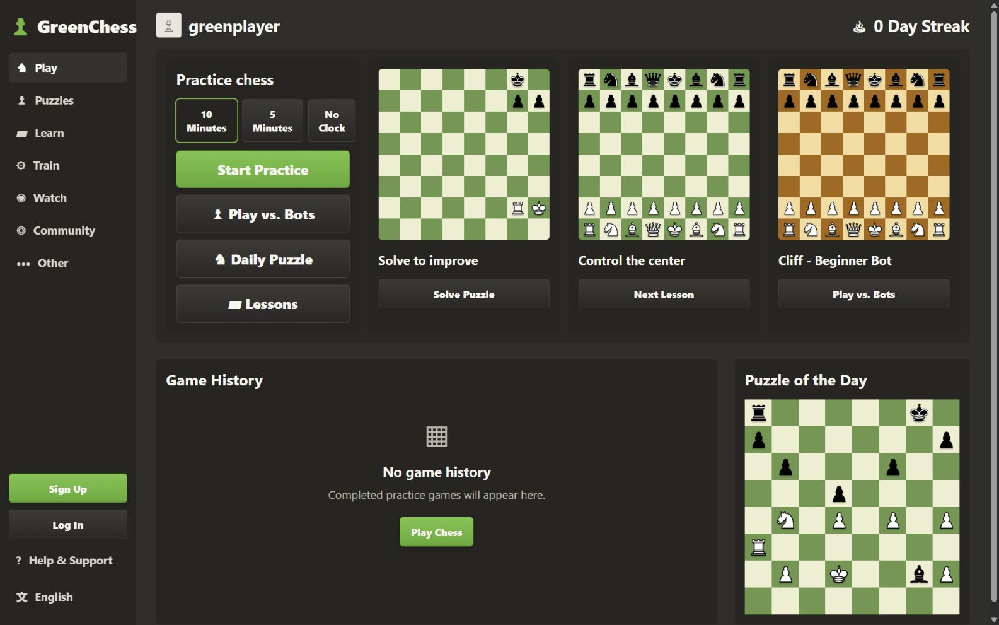
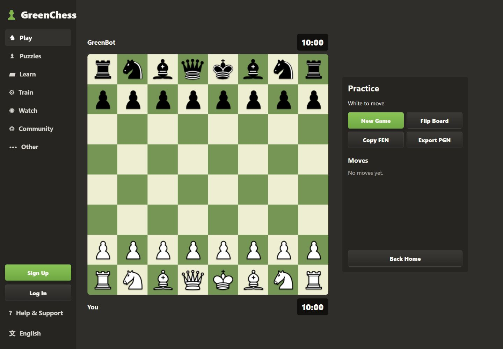
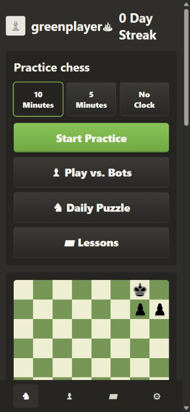
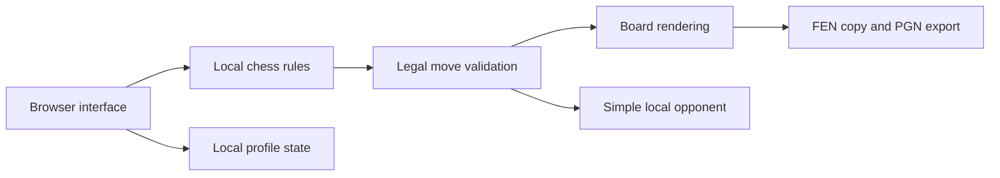

<div align="center">

  # ♟ GreenChess

  **A lightweight chess practice experience that runs entirely in the browser.**

  [](https://pxnami.github.io/GreenChess/)
  [](https://github.com/pxnami/GreenChess)
  [](https://github.com/pxnami/GreenChess/issues)

  <sub>Static, responsive, and deployable without a backend.</sub>
</div>

<br>



## About

GreenChess is a static chess practice site built with plain HTML, CSS, and JavaScript. It combines a local chessboard, a simple browser-based opponent, practice controls, and dashboard-style training areas in a responsive interface.

Everything runs locally in the browser. There are no accounts, servers, matchmaking queues, sockets, or online multiplayer services.

## Features

| Play | Practice | Control |
| --- | --- | --- |
| Click-to-move and drag-and-drop input | Local opponent that selects legal moves | Flip the board |
| Legal move indicators | Puzzle and lesson-style sections | Copy the current FEN |
| Check and last-move highlighting | Configurable practice clock | Export a PGN file |
| Castling, en passant, and promotion | Locally stored profile state | Desktop and mobile layouts |

## Interface

<table>
  <tr>
    <td width="72%"></td>
    <td width="28%"></td>
  </tr>
  <tr>
    <td align="center"><sub>Practice board, move history, clock, and game controls.</sub></td>
    <td align="center"><sub>Compact navigation and training cards on mobile.</sub></td>
  </tr>
</table>

## How it works



The chess logic lives in `public/script.js`. It validates piece movement, prevents moves that leave the king in check, handles special moves, records notation, and detects game-ending positions. The built-in opponent chooses from its available legal moves and prioritizes captures when possible.

The application deliberately avoids runtime dependencies and external services. Chess pieces are rendered from the included Cburnett asset set.

## Technology

| Area | Implementation |
| --- | --- |
| Interface | Semantic HTML and responsive CSS |
| Game logic | Vanilla JavaScript |
| State | Browser memory and `localStorage` |
| Development server | Small Node.js static server |
| Verification | Node.js syntax checks |
| Deployment | GitHub Actions and GitHub Pages |

## Run locally

Node.js 20 or newer is recommended.

```sh
git clone https://github.com/pxnami/GreenChess.git
cd GreenChess
npm install
npm run dev
```

Open [http://localhost:3000](http://localhost:3000).

### Commands

```sh
npm run dev      # Start the local static server
npm run check    # Validate JavaScript syntax
npm run build    # Copy the production site to dist/
```

## Project structure

```text
.github/workflows/    GitHub Pages deployment
docs/screenshots/     README previews
public/               Application source and chess assets
scripts/              Development server and static build
dist/                 Generated production output
```

## Deployment

The [GitHub Pages workflow](.github/workflows/pages.yml) checks the JavaScript, builds the static site, and deploys `dist/` whenever `main` is updated. The application has no environment variables or server-side services.

Live site: [pxnami.github.io/GreenChess](https://pxnami.github.io/GreenChess/)

## Limitations

- The built-in opponent is intentionally simple and is not a competitive chess engine.
- Puzzle, lesson, community, and watch areas are interface demonstrations rather than connected online services.
- Profile information is stored only in the current browser.
- GreenChess does not provide online accounts, cloud synchronization, matchmaking, or multiplayer.

## Attribution

Chess piece images use the [Cburnett chess set](https://commons.wikimedia.org/wiki/Category:SVG_chess_pieces) by Cburnett and are licensed under [CC BY-SA 3.0](https://creativecommons.org/licenses/by-sa/3.0/). The asset license remains separate from the GreenChess source-code license.

## License

GreenChess source code is available under the [MIT License](LICENSE).
